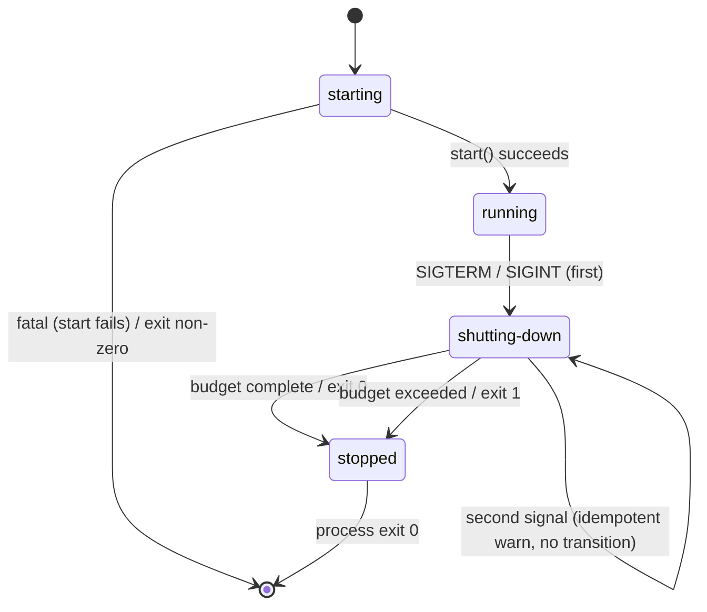
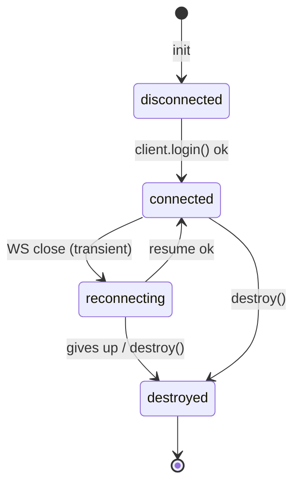
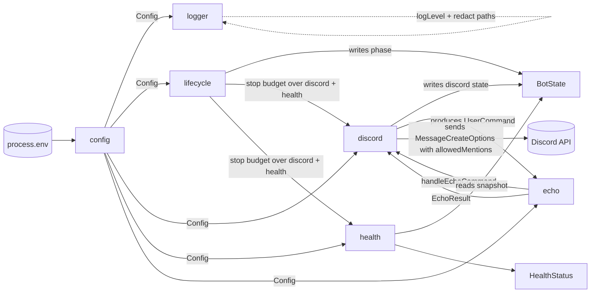

# Data Model — `001-vps-discord-bot`

**Date**: 2026-07-22 · **Spec**: `specs/001-vps-discord-bot/spec.md` · **Research**: `specs/001-vps-discord-bot/research.md`

## Persistence posture

There is **no persisted data** in v1 (FR-008). Every entity below is an in-memory, request-scoped or process-scoped object; none of them are written to disk, a database, or a cache. The model is specified here so the module contracts (`contracts/`) have a precisely-typed shape to bind against, and so the Constitution's "multi-user from day one" rule (Constraint) is honoured at the type level even though v1 has no multi-user *features*.

TypeScript types live in `src/shared/types.ts`; the shapes below are the authoritative source the contracts reference.

---

## Entity 1 — `Config`

**Owner module**: `src/config/`
**Lifecycle**: created once at startup, immutable thereafter, never logged at value-level.

| Field | Type | Validation | Secret | Source |
|---|---|---|---|---|
| `discordToken` | `string` | non-empty | **yes** (redacted in logs) | `DISCORD_TOKEN` |
| `logLevel` | `'trace'\|'debug'\|'info'\|'warn'\|'error'\|'fatal'` | enum | no | `LOG_LEVEL` (default `info`) |
| `commandPrefix` | `string` | 1–4 chars, no whitespace | no | `COMMAND_PREFIX` (default `!`) |
| `echoCommandName` | `string` | non-empty, lowercase | no | `ECHO_COMMAND_NAME` (default `echo`) |
| `echoMaxLength` | `number` | integer, 1900 ≤ x ≤ 1900-discretion; min 1 | no | `ECHO_MAX_LENGTH` (default `1900`) |
| `shutdownTimeoutMs` | `number` | integer, 1000–30000 | no | `SHUTDOWN_TIMEOUT_MS` (default `5000`) |
| `healthHost` | `string` | IPv4 literal | no | `HEALTH_HOST` (default `127.0.0.1`) |
| `healthPort` | `number` | integer, 1–65535 | no | `HEALTH_PORT` (default `8081`) |

**Validation rules** (enforced by a `zod` schema, FR-003):
- A *missing* required field or a *malformed* optional field MUST cause the loader to emit exactly **one** `fatal` structured log line naming `env.<field>` and exit non-zero.
- `discordToken` is never enumerated in any log line; the logger's `redact.paths` covers `["discordToken", "*.discordToken", "*.token"]` (research R3).

---

## Entity 2 — `BotState` (process-scoped, in-memory)

**Owner module**: `src/shared/` (type) + `src/lifecycle/` & `src/discord/` (writers). Shared snapshot the health module reads.
**Lifecycle**: one instance per process, mutated only via the two state machines below.

```typescript
type BotState = {
  phase: ProcessPhase;
  discord: ConnectionState;
  startedAt: number;      // epoch ms
  lastStateChangeAt: number;
};
```

### State machine 2a — `ProcessPhase`



Phases: `starting` | `running` | `shutting-down` | `stopped`.
**Rules**: `shutting-down` is a one-way gate (Edge Case: second stop signal is logged idempotently, no restart). `stopped` is terminal and immediately followed by `process.exit`.

### State machine 2b — `ConnectionState` (set by `DiscordAdapter`)



Phases: `disconnected` (initial, pre-login) | `connected` | `reconnecting` | `destroyed`.
**Rules**: transitions are logged at `info` for `connected`, `warn` for `reconnecting`, `info` for `destroyed` (FR-004, FR-012). Auto-reconnect is owned by discord.js (research R2); the adapter only reflects the library's emitted `Events.ShardDisconnect` / `Events.ShardResumed` into this state.

---

## Entity 3 — `UserCommand` (request-scoped, in-memory, not persisted)

**Owner module**: `src/discord/` (produced) → `src/echo/` (consumed). Lives for the duration of one `Events.MessageCreate` handler call.

```typescript
type UserCommand = {
  correlationId: string;          // ULID or crypto.randomUUID(); bound to the pino child logger
  userId: string;                 // message.author.id            (multi-user-scoped, Principle IV)
  guildId: string | null;          // message.guild?.id ?? null
  channelId: string;              // message.channel.id
  authorIsBot: boolean;            // ignore bot-issued echoes
  rawContent: string;             // message.content verbatim
  commandName: string;             // matched command, lowercase
  args: string;                   // text after "<prefix><command> ", may be ""
  receivedAt: number;             // epoch ms
};
```

**Validation / acceptance mapping** (from spec §User Story 1):
- `authorIsBot === true` → ignore (never echo bots).
- Does not start with `commandPrefix` → ignore (not a command).
- `commandName !== echoCommandName` → out of v1 scope; ignore.
- `args === ""` → FR/Story1 #2: reply with usage hint, do **not** call echo core; status `usage-hint`.
- `args.length > echoMaxLength` → FR/Story1 #3: reply with user-facing "input too long" error; status `too-long`.
- Otherwise → call `handleEchoCommand`; status `echoed`.

---

## Entity 4 — `EchoResult` (request-scoped, in-memory, not persisted)

**Owner module**: `src/echo/`. Pure function output.

```typescript
type EchoResult =
  | { status: 'echoed';          reply: string; neutralizedMentions: boolean }
  | { status: 'too-long';        reply: string }     // user-facing error text
  | { status: 'usage-hint';      reply: string };    // user-facing hint text
```

**Mention-neutralization contract (FR-013)**:
- `reply` carries the echoed text **as-is** for cosmetic markdown (allowed), but the *send call* is always made with `allowedMentions: { parse: [], users: [], roles: [] }` so no user/role/`@everyone`/`@here` renders a notification on the echoed reply (research R2). `neutralizedMentions` is `true` unconditionally on `echoed` and exists as an auditable field for SC-006 / a future test assertion.
- The echo core never inspects token strings; neutralization is a transport-level guarantee the discord adapter enforces when it converts `EchoResult` into `MessageCreateOptions`.

**Validation rules**:
- `reply` MUST be ≤ 2000 chars (Discord message limit); the `echoMaxLength` default of 1900 leaves headroom for any fixed reply framing and is enforced **before** send.
- No transformation of `args` other than the zero-byte-trim and length cap; the payload is otherwise echoed verbatim (Story 1 #1: "derived from the user's input, not a fixed or hardcoded message").

---

## Entity 5 — `HealthStatus` (produced on demand, not persisted)

**Owner module**: `src/health/`. Produced by the status mapper from `BotState`.

```typescript
type HealthStatus = {
  status: 'healthy' | 'degraded' | 'shutting-down' | 'unhealthy';
  phase: ProcessPhase;
  discord: ConnectionState;
  uptimeMs: number;
  checkedAt: number;               // epoch ms
};
```

**Mapper** (reproduced from research R4; authoritative for `contracts/health.md`):

| `BotState.phase` | `BotState.discord` | HTTP status | `HealthStatus.status` |
|---|---|---|---|
| `starting` / `running` | `connected` | 200 | `healthy` |
| `starting` / `running` | `disconnected` / `reconnecting` | 200 | `degraded` |
| `shutting-down` | any | 503 | `shutting-down` |
| `stopped` | any | 503 | `unhealthy` |

**Rules**: the mapper performs no I/O (FR-007). `uptimeMs = checkedAt - startedAt`. A response MUST be produced within 1 s (SC-004); trivially satisfied since the handler only reads the shared object and serializes JSON.

---

## Relationships



All arrows are typed function calls across module boundaries (Principle II "inter-module communication through explicit, documented interfaces"); there is **no shared mutable state** other than the single `BotState` snapshot, whose only writers are `lifecycle` (phase) and `discord` (connection state), and whose only reader is `health`.

---

## Multi-user isolation note (Constitution Constraint)

`UserCommand.userId` / `guildId` are **request-scoped inputs** carried through the echo handler, never promoted to process-global state. The echo core is a pure function of `(UserCommand, Config)` and cannot access another user's data — both because there is no other-user data (FR-008: nothing is persisted) and because the contract forbids it (see `contracts/echo-command.md`). This satisfies "user-scoped, cross-user access forbidden by design" at the contract level even though v1 has no multi-user *feature*.
